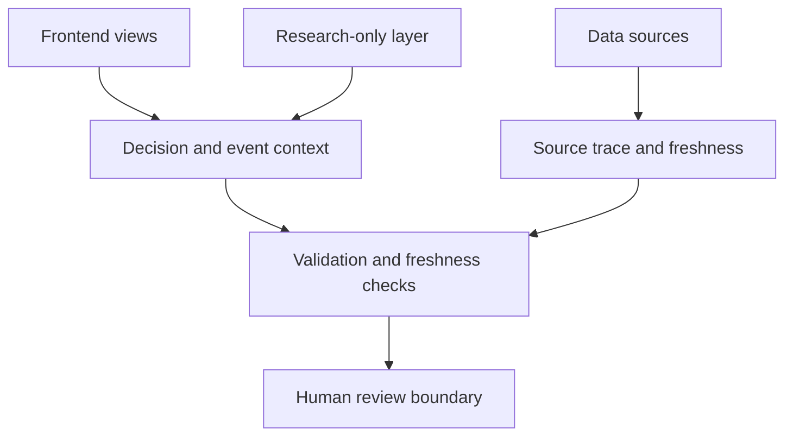

  <picture>
    <source media="(prefers-color-scheme: dark)" srcset="Logo/prism-logo-light.png">
    <source media="(prefers-color-scheme: light)" srcset="Logo/prism-logo-dark.jpg">
    
  </picture>

<h1 align="center">Prism</h1>

  Human-in-the-loop AI system for engineering observability, decision explainability, 
  validation workflows, and research-oriented market monitoring.

  <a href="README.zh-CN.md">中文</a> ·
  <a href="docs/architecture.md">Architecture</a> ·
  <a href="docs/phase3c-validation.md">Validation</a> ·
  <a href="docs/safety-boundaries.md">Safety</a> ·
  <a href="docs/roadmap.md">Roadmap</a>

  
  
  
  

---

## Overview

Prism is a documentation-first public overview of a human-in-the-loop AI system for engineering observability, decision explainability, validation workflows, and research-oriented market monitoring.

The project is built around a simple principle: AI can help organize signals, validation results, source context, and operational status, but important decisions should remain explainable, auditable, and manually controlled.

This public repository is intended to explain the project architecture, safety boundaries, modules, and roadmap. Production secrets, private deployment details, account data, server configuration, raw logs, and sensitive operational material are intentionally excluded.

## Why Prism?

AI-assisted systems need more than model output. They need:

- clear system observability,
- traceable decision context,
- validation workflows,
- source freshness checks,
- separation between research, simulation, and real-world review,
- and explicit human oversight before important actions.

Prism explores how these pieces can be organized into a safer and more understandable engineering system.

## Core modules

| Module | Purpose |
| --- | --- |
| Engineering Viewer | Presents validation, source freshness, and system-level observability. |
| Decision Cards | Explains why an item appears, what context exists, and what limitations apply. |
| Event Intelligence | Adds display-only context such as earnings, SEC events, sector signals, and ETF flow. |
| Source Trace | Tracks where information came from and whether the source is fresh enough to trust. |
| Research Lab | Provides a research-only environment for market observation and hypothesis tracking. |
| Safety Boundaries | Keeps display-only information separated from production action paths. |

## Architecture sketch

## Project focus

Prism focuses on:

- engineering observability for a semi-automatic AI system,
- decision explanation cards for market candidates and holdings,
- phase-based validation workflows,
- runtime and end-of-day validation visibility,
- source freshness and traceability,
- event intelligence such as earnings, SEC events, sector context, and ETF flow,
- separation between real holdings, virtual holdings, shadow candidates, research-only items, and news-only items.

## What Prism does not do

Prism is not positioned as a fully automatic trading bot.

It does not aim to:

- automatically execute live trades without human confirmation,
- provide financial advice,
- replace risk management or human review,
- treat display-only research signals as production gates,
- let experimental validators directly affect production counting or release decisions.

## Preview

Screenshots and diagrams may be added after review and redaction.

Public deployment URLs are intentionally not listed in this repository.

## Repository scope

This repository is currently documentation-first. Source code and additional artifacts may be published gradually after security, privacy, and operational review.

Excluded from this repository:

- production secrets,
- broker details,
- server configuration,
- private logs,
- `.env` files,
- webhooks,
- account credentials,
- sensitive trading or operational data.

## Documentation

English:

- [Architecture](docs/architecture.md)
- [Phase 3c Validation](docs/phase3c-validation.md)
- [Decision Cards](docs/decision-card.md)
- [Event Intelligence](docs/event-intelligence.md)
- [Frontend Pages](docs/frontend-pages.md)
- [Safety Boundaries](docs/safety-boundaries.md)
- [Roadmap](docs/roadmap.md)

中文：

- [系统架构](docs/architecture.zh-CN.md)
- [Phase 3c 验证](docs/phase3c-validation.zh-CN.md)
- [Decision Card 决策解释卡](docs/decision-card.zh-CN.md)
- [Event Intelligence 事件情报](docs/event-intelligence.zh-CN.md)
- [前端页面](docs/frontend-pages.zh-CN.md)
- [安全边界](docs/safety-boundaries.zh-CN.md)
- [路线图](docs/roadmap.zh-CN.md)

## Bilingual maintenance policy

English and Chinese documentation should be revised together. When the project scope, safety boundary, validation design, or roadmap changes, both language versions should be updated in the same maintenance pass.

## License

License information will be finalized as the public repository matures.

## Disclaimer

This project is for research, engineering observability, and human-in-the-loop decision support. It is not financial advice and should not be used as a basis for live trading without independent review and risk controls.
