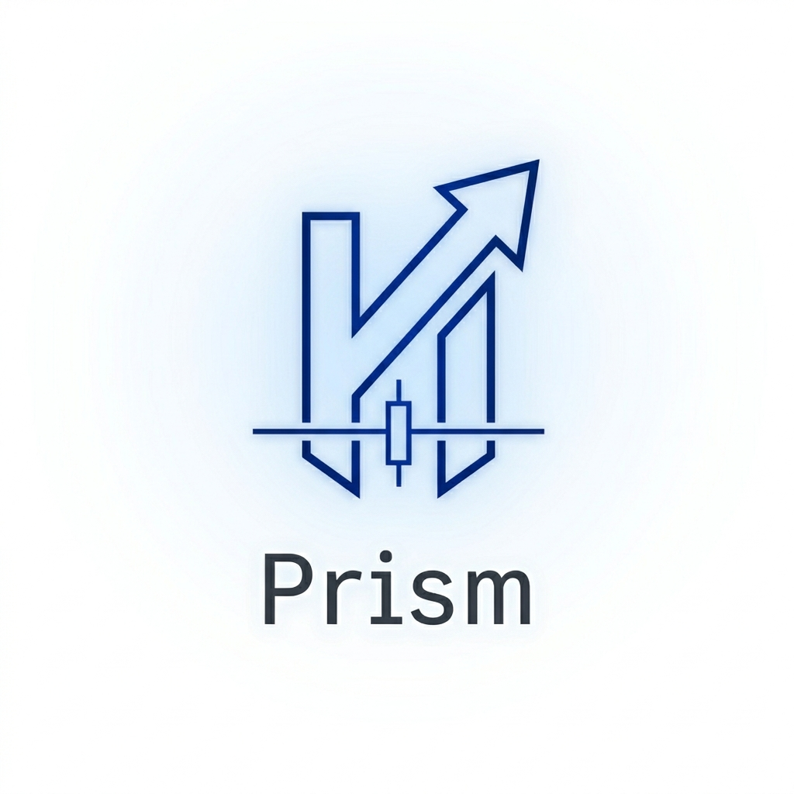

  <picture>
    <source media="(prefers-color-scheme: dark)" srcset="docs/Logo/prism-logo-light.png">
    <source media="(prefers-color-scheme: light)" srcset="docs/Logo/prism-logo-dark.png">
    
  </picture>

<h1 align="center">Prism</h1>

  面向工程可观测性、决策解释、验证流程和研究型市场监控的 
  human-in-the-loop AI 系统。

  <a href="README.md">English</a> ·
  <a href="https://heyaaron-wu.github.io/Prism/">静态前端快照</a> ·
  <a href="docs/architecture/architecture.zh-CN.md">系统架构</a> ·
  <a href="docs/validation/phase3c-validation.zh-CN.md">验证流程</a> ·
  <a href="docs/governance/safety-boundaries.zh-CN.md">安全边界</a> ·
  <a href="docs/governance/roadmap.zh-CN.md">路线图</a>

---

## 概览

Prism 是一个 documentation-first 的公开项目概览，用于介绍一个面向工程可观测性、决策解释、验证流程和研究型市场监控的 human-in-the-loop AI 系统。

项目的核心原则是：AI 可以帮助整理信号、验证结果、来源上下文和运行状态，但重要决策必须保持可解释、可审计，并由人类手动控制。

## 静态前端快照

Prism 前端的公开安全静态快照已发布到 GitHub Pages：

- [打开 Prism 静态前端快照](https://heyaaron-wu.github.io/Prism/)
- [Engineering 快照](https://heyaaron-wu.github.io/Prism/site/engineering.html)
- [Market 快照](https://heyaaron-wu.github.io/Prism/site/market.html)
- [Monitor 快照](https://heyaaron-wu.github.io/Prism/site/monitor.html)
- [Research 快照](https://heyaaron-wu.github.io/Prism/site/research.html)

这些页面是静态、脱敏后的前端快照，不连接生产系统。

## 文档分类

架构：

- [Architecture](docs/architecture/architecture.md)
- [系统架构](docs/architecture/architecture.zh-CN.md)

验证：

- [Phase 3c Validation](docs/validation/phase3c-validation.md)
- [Phase 3c 验证](docs/validation/phase3c-validation.zh-CN.md)

模块：

- [Decision Cards](docs/modules/decision-card.md)
- [Decision Card 决策解释卡](docs/modules/decision-card.zh-CN.md)
- [Event Intelligence](docs/modules/event-intelligence.md)
- [Event Intelligence 事件情报](docs/modules/event-intelligence.zh-CN.md)
- [Frontend Pages](docs/modules/frontend-pages.md)
- [前端页面](docs/modules/frontend-pages.zh-CN.md)

治理：

- [Safety Boundaries](docs/governance/safety-boundaries.md)
- [安全边界](docs/governance/safety-boundaries.zh-CN.md)
- [Roadmap](docs/governance/roadmap.md)
- [路线图](docs/governance/roadmap.zh-CN.md)

## 公开边界

本仓库用于说明项目架构、安全边界、模块设计和路线图。生产密钥、私有部署细节、账户数据、服务器配置、原始日志和敏感运行资料不会放入本仓库。

## 双语维护原则

英文和中文文档应同步修订。当项目范围、安全边界、验证设计或路线图发生变化时，两种语言版本应在同一次维护中一起更新。

## License

License 信息会在公开仓库成熟后再最终确定。

## Disclaimer

本项目用于研究、工程可观测性和 human-in-the-loop 决策支持。它不是金融建议，也不应在没有独立复核和风险控制的情况下作为真实交易依据。
