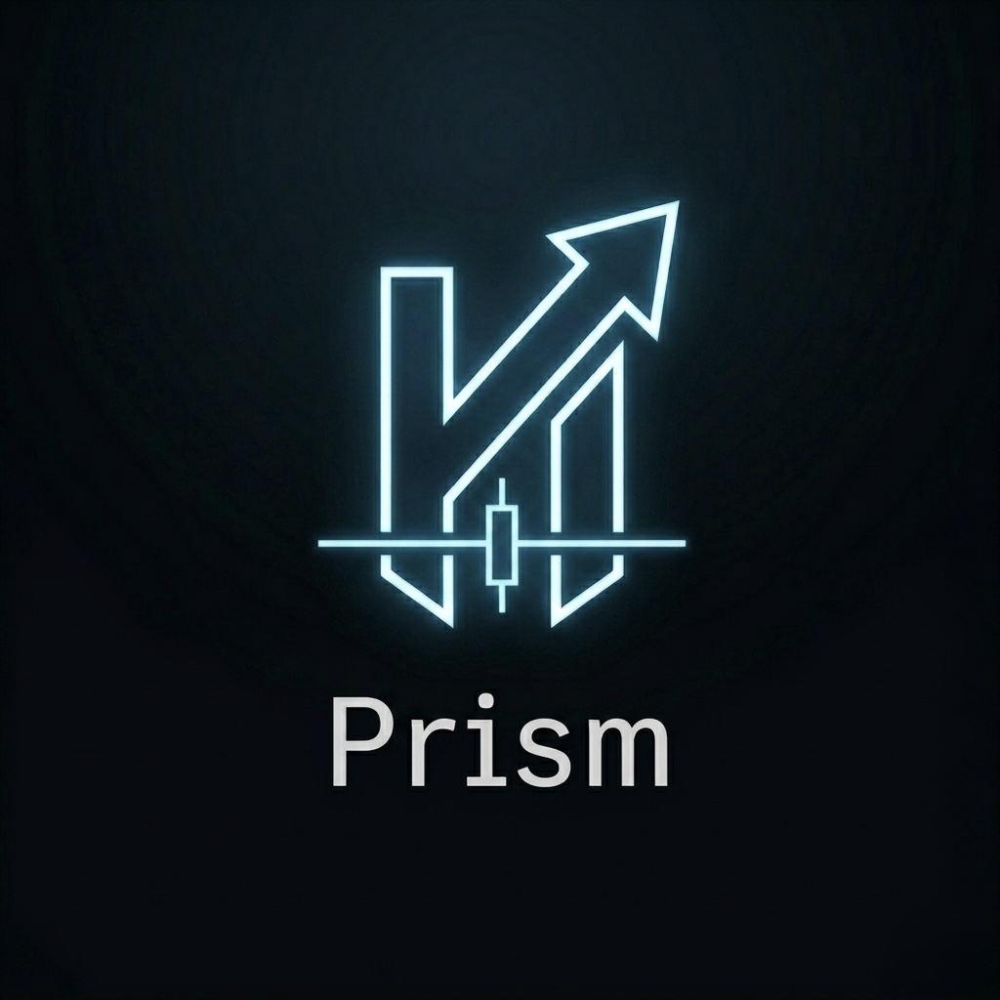
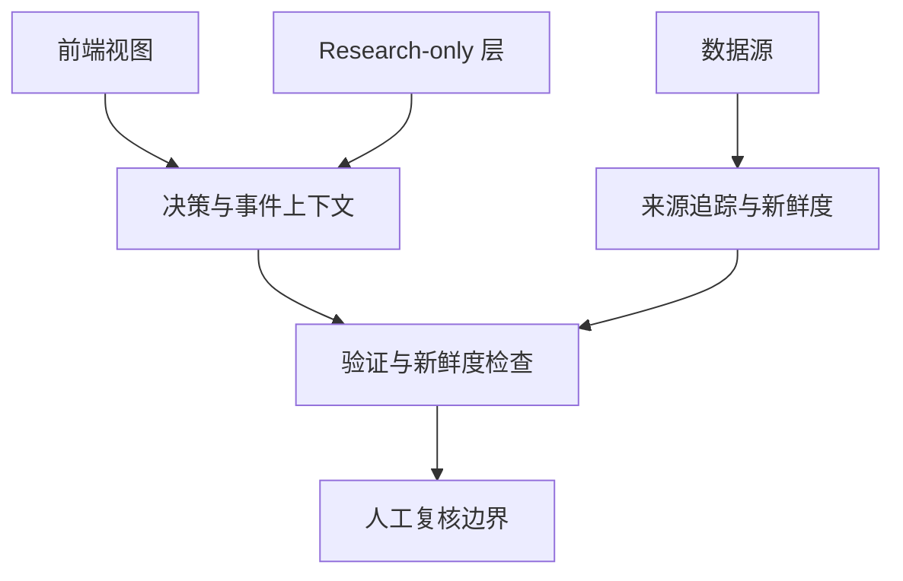

  <picture>
    <source media="(prefers-color-scheme: dark)" srcset="Logo/prism-logo-light.png">
    <source media="(prefers-color-scheme: light)" srcset="Logo/prism-logo-dark.jpg">
    
  </picture>

<h1 align="center">Prism</h1>

  面向工程可观测性、决策解释、验证流程和研究型市场监控的 
  human-in-the-loop AI 系统。

  <a href="README.md">English</a> ·
  <a href="docs/architecture.zh-CN.md">系统架构</a> ·
  <a href="docs/phase3c-validation.zh-CN.md">验证流程</a> ·
  <a href="docs/safety-boundaries.zh-CN.md">安全边界</a> ·
  <a href="docs/roadmap.zh-CN.md">路线图</a>

  
  
  
  

---

## 概览

Prism 是一个 documentation-first 的公开项目概览，用于介绍一个面向工程可观测性、决策解释、验证流程和研究型市场监控的 human-in-the-loop AI 系统。

项目的核心原则很简单：AI 可以帮助整理信号、验证结果、来源上下文和运行状态，但重要决策必须保持可解释、可审计，并由人类手动控制。

本公开仓库用于说明项目架构、安全边界、模块设计和路线图。生产密钥、私有部署细节、账户数据、服务器配置、原始日志和敏感运行资料都不会放入本仓库。

## 为什么做 Prism？

AI 辅助系统不能只看模型输出，还需要：

- 清晰的系统可观测性，
- 可追踪的决策上下文，
- 验证流程，
- 数据源新鲜度检查，
- 研究、模拟和真实复核之间的边界，
- 以及重要动作前的人工监督。

Prism 探索如何把这些部分组织成一个更安全、更容易理解的工程系统。

## 核心模块

| 模块 | 作用 |
| --- | --- |
| Engineering Viewer | 展示验证、数据源新鲜度和系统级可观测性。 |
| Decision Cards | 解释对象为什么出现、有哪些上下文、有哪些限制。 |
| Event Intelligence | 提供财报、SEC 事件、板块信号和 ETF flow 等 display-only 上下文。 |
| Source Trace | 追踪信息来源，并判断数据源是否足够新鲜。 |
| Research Lab | 提供 research-only 的市场观察和假设跟踪环境。 |
| Safety Boundaries | 保持 display-only 信息与生产动作路径分离。 |

## 架构简图

## 项目重点

Prism 关注：

- 半自动 AI 系统的工程可观测性，
- 针对候选对象和持仓上下文的 Decision Card 决策解释，
- 分阶段验证流程，
- runtime 与 EOD 验证可视化，
- 数据源新鲜度与来源追踪，
- 财报、SEC 事件、板块上下文和 ETF flow 等事件情报，
- 明确区分真实持仓、虚拟持仓、Shadow 候选、research-only 项和 news-only 项。

## Prism 不做什么

Prism 不定位为完全自动交易机器人。

它不试图：

- 在没有人工确认的情况下自动执行真实交易，
- 提供金融投资建议，
- 替代风险管理或人工复核，
- 把 display-only 研究信号当作生产 gate，
- 让实验性 validator 直接影响生产计数或发布判断。

## 项目预览

截图和架构图会在审查和脱敏后逐步加入。

公开部署网址不会列在本仓库中。

## 仓库范围

本仓库当前以文档和项目说明为主。源码和其他资料会在安全、隐私和运行审查后逐步公开。

本仓库不会包含：

- 生产密钥，
- 券商细节，
- 服务器配置，
- 私有日志，
- `.env` 文件，
- webhook，
- 账户凭据，
- 敏感交易或运行数据。

## 文档

English:

- [Architecture](docs/architecture.md)
- [Phase 3c Validation](docs/phase3c-validation.md)
- [Decision Cards](docs/decision-card.md)
- [Event Intelligence](docs/event-intelligence.md)
- [Frontend Pages](docs/frontend-pages.md)
- [Safety Boundaries](docs/safety-boundaries.md)
- [Roadmap](docs/roadmap.md)

中文：

- [系统架构](docs/architecture.zh-CN.md)
- [Phase 3c 验证](docs/phase3c-validation.zh-CN.md)
- [Decision Card 决策解释卡](docs/decision-card.zh-CN.md)
- [Event Intelligence 事件情报](docs/event-intelligence.zh-CN.md)
- [前端页面](docs/frontend-pages.zh-CN.md)
- [安全边界](docs/safety-boundaries.zh-CN.md)
- [路线图](docs/roadmap.zh-CN.md)

## 双语维护原则

英文和中文文档应同步修订。当项目范围、安全边界、验证设计或路线图发生变化时，两种语言版本应在同一次维护中一起更新。

## License

License 信息会在公开仓库成熟后再最终确定。

## Disclaimer

本项目用于研究、工程可观测性和 human-in-the-loop 决策支持。它不是金融建议，也不应在没有独立复核和风险控制的情况下作为真实交易依据。
