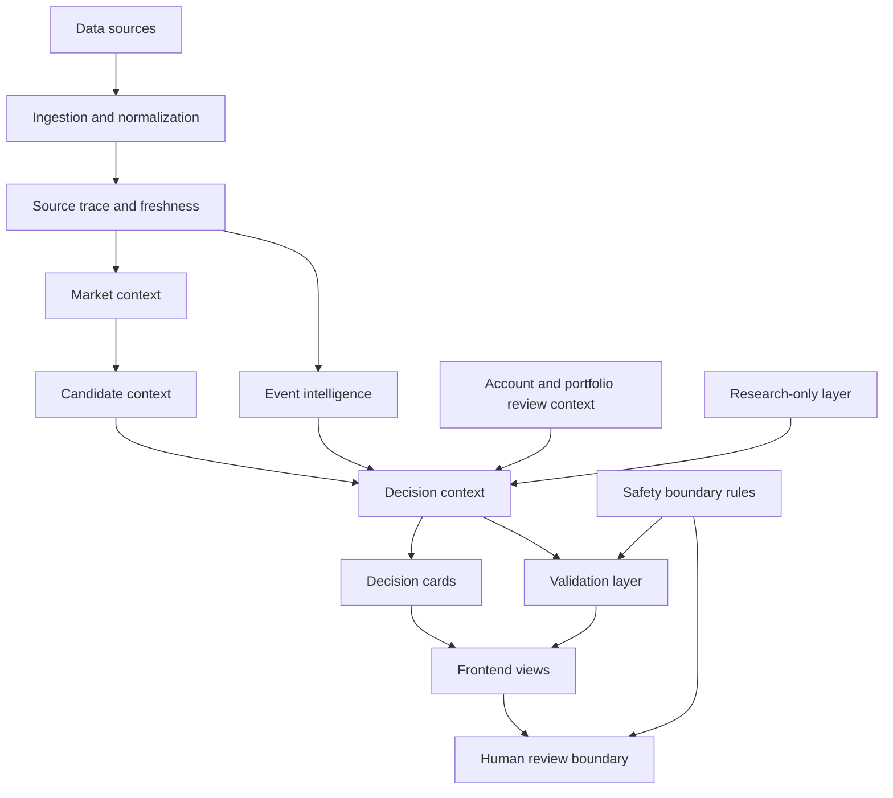

# Prism Architecture

Prism is organized as a layered human-in-the-loop system. Its architecture separates data intake, context building, explanation, validation, interface presentation, and human review.

This document describes the public-safe architecture. It intentionally avoids private deployment paths, server details, account data, broker configuration, secrets, webhooks, raw production logs, and execution internals.

## Core idea

Prism is not designed as a black-box trading bot. It is designed as an engineering system where AI-assisted research, monitoring, validation, and explanation remain separated from real-world action.

The architecture is built around four principles:

1. Observation and explanation should be visible.
2. Validation should be explicit and auditable.
3. Research-only signals should not be confused with production gates.
4. Important real-world actions require human review.

## Public-safe end-to-end chain

```text
Data Sources
  ↓
Ingestion and Normalization
  ↓
Source Trace and Freshness
  ↓
Market Context
  ↓
Account / Portfolio Review Context
  ↓
Candidate Context
  ↓
Event Intelligence
  ↓
Decision Context
  ↓
Decision Cards
  ↓
Validation Layer
  ↓
Frontend Views
  ↓
Human Review Boundary
```

## Layered architecture



## Core modules

| Module | Role |
| --- | --- |
| Data Ingestion | Collects external and internal inputs into a normalized system shape. |
| Normalization | Converts raw source output into safer, comparable records. |
| Source Trace | Tracks where information came from and how it entered the system. |
| Freshness Panel | Makes source staleness and availability visible. |
| Market Context | Organizes market-level and symbol-level context for review. |
| Account / Portfolio Review Context | Separates real, virtual, paper, shadow, and research-only scopes. |
| Candidate Context | Describes why an item entered the review universe. |
| Event Intelligence | Adds display-only context such as earnings, filing events, sector context, and ETF flow. |
| Decision Context | Combines source, event, candidate, and review context into a structured explanation payload. |
| Decision Cards | Presents concise and detailed explanation views for human review. |
| Validation Layer | Checks whether required runtime and end-of-day validation conditions are satisfied. |
| Phase / EOD Viewer | Presents validation results without changing validation rules. |
| Research Lab | Provides a research-only space for hypotheses and exploratory observation. |
| Frontend Views | Presents engineering, market, research, monitoring, and status interfaces. |
| Safety Boundaries | Prevents display-only or experimental signals from being treated as production action. |
| Human Review Boundary | Keeps final real-world decisions under manual human control. |
| Operations / Monitoring | Tracks system health, visibility, and review readiness. |

## Context model

Prism separates context into explicit domains:

```text
source_context
market_context
account_context
portfolio_context
candidate_context
event_context
risk_context
freshness_context
validation_context
safety_flags
```

These contexts are meant to make explanations easier to inspect. They are not a guarantee of correctness, and they do not replace independent review.

## Scope separation

The architecture distinguishes between different types of objects:

```text
REAL_CONTEXT       real-account or real-position review context
VIRTUAL_CONTEXT    virtual or paper-account review context
SHADOW_CONTEXT     validation-only candidate context
RESEARCH_ONLY      research-only observation
NEWS_ONLY          news or event-only context
DISCOVERED         discovered but not promoted into a stronger scope
```

This separation prevents explanation and research layers from being mistaken for executable instructions.

## Validation boundary

The validation layer is responsible for making system readiness and failure conditions visible. Display-only modules cannot weaken validation standards.

Examples of validation concepts include:

- scheduled validation runs,
- runtime checks,
- end-of-day validation views,
- source freshness requirements,
- deduplication guards,
- production-versus-shadow validator separation,
- manual-review requirements.

The public repository explains these concepts at a design level. It does not publish private operational counters, raw failure logs, broker details, or production execution internals.

## Frontend boundary

Frontend views are designed for visibility, not for bypassing human review.

Typical public-safe view categories include:

- engineering observability,
- market overview,
- research workspace,
- monitoring dashboard,
- system status,
- decision explanation views.

Public deployment URLs are intentionally excluded from this repository.

## Safety model

Prism's safety model is based on separation:

- observation is separated from execution,
- explanation is separated from validation,
- research-only information is separated from production decisions,
- experimental validators are separated from production validation authority,
- public documentation is separated from private deployment details.

## What is intentionally not documented here

This public architecture document does not include:

- broker credentials,
- production account identifiers,
- raw trading logs,
- private server paths,
- webhook URLs,
- `.env` values,
- production database dumps,
- direct execution internals,
- sensitive runtime incident payloads.

Those details are outside the public documentation scope.
