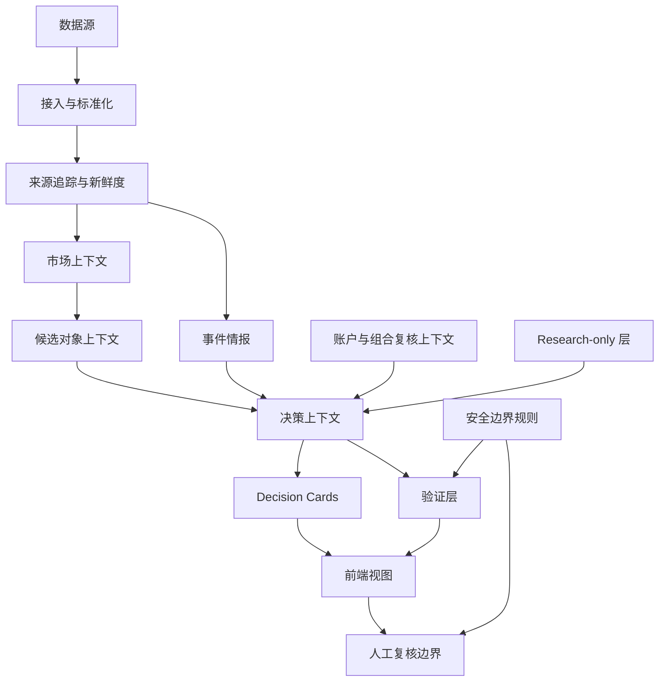

# Prism 系统架构

Prism 是一个分层的 human-in-the-loop 系统。它把数据接入、上下文构建、解释层、验证层、前端展示和人工复核边界清楚分开。

本文描述的是公开安全版本的架构说明，不包含私有部署路径、服务器细节、账户数据、券商配置、密钥、webhook、原始生产日志或执行内部细节。

## 核心思路

Prism 不定位为黑箱自动交易机器人。它更像一个工程系统：AI 可以辅助研究、监控、验证和解释，但这些内容必须与真实世界动作保持边界。

架构围绕四个原则设计：

1. 观察与解释必须可见。
2. 验证必须明确且可审计。
3. research-only 信号不能被误认为 production gate。
4. 重要真实世界动作必须经过人工复核。

## 公开安全版完整链路

```text
数据源
  ↓
接入与标准化
  ↓
来源追踪与新鲜度
  ↓
市场上下文
  ↓
账户 / 组合复核上下文
  ↓
候选对象上下文
  ↓
事件情报
  ↓
决策上下文
  ↓
Decision Cards
  ↓
验证层
  ↓
前端视图
  ↓
人工复核边界
```

## 分层架构



## 核心模块

| 模块 | 作用 |
| --- | --- |
| Data Ingestion | 将外部和内部输入接入系统。 |
| Normalization | 将原始来源输出转换成更安全、可比较的记录。 |
| Source Trace | 追踪信息来源和进入系统的路径。 |
| Freshness Panel | 展示数据源的新鲜度、可用性和过期风险。 |
| Market Context | 组织市场级和对象级上下文，供人工复核。 |
| Account / Portfolio Review Context | 区分真实、虚拟、paper、shadow 和 research-only 范围。 |
| Candidate Context | 说明对象为什么进入复核范围。 |
| Event Intelligence | 提供财报、披露事件、板块上下文和 ETF flow 等 display-only 信息。 |
| Decision Context | 将来源、事件、候选对象和复核上下文组合成结构化解释 payload。 |
| Decision Cards | 为人工复核提供摘要和详情解释视图。 |
| Validation Layer | 检查 runtime 与 EOD 相关验证条件是否满足。 |
| Phase / EOD Viewer | 展示验证结果，但不改变验证规则。 |
| Research Lab | 提供 research-only 的假设记录和探索性观察空间。 |
| Frontend Views | 展示工程、市场、研究、监控和状态页面。 |
| Safety Boundaries | 防止 display-only 或实验性信号被当作 production action。 |
| Human Review Boundary | 让最终真实世界决策保持人工控制。 |
| Operations / Monitoring | 追踪系统健康、可见性和复核准备状态。 |

## 上下文模型

Prism 将上下文拆成明确的领域：

```text
source_context
market_context
account_context
portfolio_context
candidate_context
event_context
risk_context
freshness_context
validation_context
safety_flags
```

这些上下文用于让解释更容易检查，但它们不保证结论一定正确，也不能替代独立复核。

## 范围分离

架构会区分不同类型的对象：

```text
REAL_CONTEXT       真实账户或真实持仓复核上下文
VIRTUAL_CONTEXT    虚拟或 paper 账户复核上下文
SHADOW_CONTEXT     仅用于验证的候选上下文
RESEARCH_ONLY      仅用于研究观察
NEWS_ONLY          新闻或事件上下文
DISCOVERED         已发现但未提升为更强状态的对象
```

这种分离可以防止解释层和研究层被误认为可执行指令。

## 验证边界

验证层负责让系统准备状态和失败条件可见。display-only 模块不能削弱验证标准。

验证概念包括：

- scheduled validation run，
- runtime check，
- EOD validation view，
- 数据源新鲜度要求，
- deduplication guard，
- production validator 与 shadow validator 的分离，
- 人工复核要求。

公开仓库只解释这些概念的设计层级，不发布私有运行计数、原始失败日志、券商细节或生产执行内部逻辑。

## 前端边界

前端视图用于提高可见性，而不是绕过人工复核。

公开安全的页面类别包括：

- 工程可观测性，
- 市场概览，
- 研究工作区，
- 监控仪表盘，
- 系统状态，
- 决策解释视图。

公开部署网址不会写入本仓库。

## 安全模型

Prism 的安全模型基于分离原则：

- 观察与执行分离，
- 解释与验证分离，
- research-only 信息与生产决策分离，
- 实验性 validator 与生产验证权威分离，
- 公开文档与私有部署细节分离。

## 本文刻意不记录的内容

本公开架构文档不包含：

- 券商凭据，
- 生产账户标识，
- 原始交易日志，
- 私有服务器路径，
- webhook URL，
- `.env` 值，
- 生产数据库 dump，
- 直接执行内部逻辑，
- 敏感 runtime incident payload。

这些都不属于公开文档范围。
